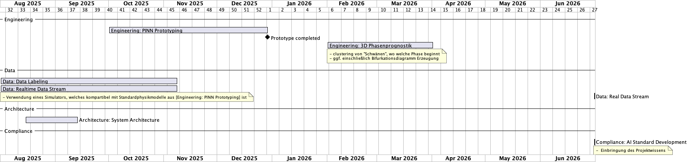

# Project Milestones

## v1.0 - Phasenprognostik
3-Dimensionale (kurz: 3D) (Input x + Output y + Hiddenparameter p (z.B. Zeit)) basierte Phasenprognostik (ggf. zusätzlich Bifurkationsdiagramm) eines Physik Models mit Hilfe eines PINN.

**Hypothese**: 3D Phasenraum ist ähnlich zu einer "Kleinsche Flasche", die ggf. aus mehreren verschachtelten Flaschen besteht.

## v2.0 - Hardware-basiertes State Monitoring
PINN über die Konvertierung zum Verilog Standard auf die Hardware eines FPGA deployen und einen Sensor anbringen, der die *Input x* Daten für das PINN registriert und an das PINN weitergibt.

### Optional: v2.1 - Analog Computer State Monitoring
Wenn die Leistung des FPGA nicht für eine vertretbare Echtzeitprognostik verwendbar ist, Verilog-basiertes Model auf einen Analog Computer deployen und damit den FPGA ersetzen.

## v3.0 - Datenarchitektur zur Einbindung externer Daten
Einbindung externer Daten zum Clustering von "Schwänen" basierend auf deren physikalischen Biomarker des Systemverhaltens aus dem Phasenraum, zur Erstellung von feature-bezogenen virtuellen "Schwänen"
