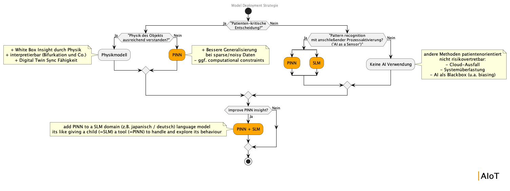

# Schwanensee

*Faust am Schwanensee*

A Python framework for developing Physics-Informed Neural Network (PINN) softsensors that enhance physical models with data-driven insights. \
Creating a PINN softsensor, which adjusts the parameters of its underlying physical model.

What is this about? I want to recite Faust, Goethe for the answer:

<blockquote>
Der Erdenkreis ist mir genug bekannt.<br>
Nach drüben ist die Aussicht uns verrannt;<br>
Tor, wer dorthin die Augen blinzelnd richtet,<br>
Sich über Wolken seinesgleichen dichtet!
</blockquote><br />

This tension illustrates that there are moments when a complete description of complex phenomena is not possible to fully grasp within the limited scope of our human understanding. This is what Faust stands for: a reminder of our limited perception. \
Therefore, complete descriptions of tissue or other physiological diagnostics may not be possible with our current methods alone. To avoid making a pact like Faust did with Mephistopheles, we instead resort to a hyperspace approach through neural networks. Their understanding of the system differs from ours, yet proves beneficial as we learn in retrospect more about our physical systems—gaining insight without sacrificing scientific integrity.<br/>

Let Faust sit on the Swan Lake (german: "Schwanensee")


### Briefer about PINNs

[PINNs](https://maziarraissi.github.io/PINNs/) can be designed to solve two classes of problems:
- data-driven solution (forward problem)
- data-driven discovery (inverse problem)

of differential equations e.g. partical differential equations (PDE).

Here we implemented the **data-driven discovery** given noisy and incomplete measurements.<br/>
It is important to understand that the PDEs (that govern a given data-set), or in generell the xDEs, get embeded into the learning process of the NN.<br/>
Explicitly speaking, the PDEs get embeded into the cost function of the NN. This is done using the DeepXDE package.<br/>
With that, the embeded PDEs act as a regularization agent that limits the space of admissible solutions of the NN training.<br/>
The PINN alone does not find any unknown/missing terms of the PDE problem.<br/>
**It only adjusts the unknown PDE parameters** as part of its cost function.


## Installation

```bash
pip install deepxde tensorflow-probability tf-keras
```

and then after this

```bash
pip install .
```


## Model Transformation Tools

### Physical Model Parser

The framework aims to provide parsers from the major physical model exchange standards so you can use these models easily by building your amazing PINN softsensor based on them.<br/>

In this example, we used a model which originated from the CellML standard which was converted to a Python script using OpenCOR:

```bash
python schwan/schwan.py --python --input example/lorenz/generated/Lorenz_1963.py
```

### Neural Network Converter

You can easily transform the TensorFlow-based PINN into a different NN model type.<br/>
The *Schwanensee* framework helps you with some standard conversions.

#### TensorFlow to ONNX

```bash
python -m tf2onnx.convert --saved-model generalized_patient --output model.onnx
```

#### ONNX to PyTorch

```bash
python schwan/parser/onnx_to_pytorch.py
```


## Examples

### Different Schwanensee Example Models Levels

```lv1``` gets used, if the user does not have multiple data time series. For this case, the initial conditions are known and can get hardcoded into the physio physics models. This improves the speed of parameter fitting, but (because of the sparse amout of time series data) could find a not generally suitable parameter set.

```lv2``` gets used in the case, that the user has multiple data time series at hand. The initial conditions in this case are variable and an input into the PINN, while finding a suitable set of parameters for the physio model.

Please note the following pattern for selecting a backend based on your OS:

#### Unix-based

```bash
DDE_BACKEND=tensorflow python example/bumpyFlight/oscillator_lv2.py
```

#### Windows-based

```bash
$env:DDE_BACKEND = "tensorflow"; python example/bumpyFlight/oscillator_lv2.py
```

### 1. Starter Example - Sine wave

Let's start by regenerating a simple sine wave using deepxde to warm ourselves up with the PINN approach:

```bash
$env:DDE_BACKEND = "tensorflow.compat.v1"; python example/sine/sine.py
```

Awesome! You see that the PINN could reproduce the pattern of the sine wave.<br/>
Let's move on to a more advanced example.

### 2. Intermediate Example - Lorenz System

One of the simplest multicomponent differential equation systems that still shows interesting chaotic behaviour is the famous Lorenz system.

```bash
$env:DDE_BACKEND = "tensorflow";  python example/lorenz/lorenz_lv2.py
DDE_BACKEND=tensorflow.compat.v1 python example/lorenz/lorenz_w_exogenous_stimulus_lv1.py
DDE_BACKEND=tensorflow python example/lorenz/lorenz_lv2.py
```

### 3. Real Example - What a bumpy flight

```bash
DDE_BACKEND=tensorflow python example/bumpyFlight/oscillator_lv2.py
```

### 4. Complete Framework Example: Using your PINN within C++

One last gimmick for you.<br/>
As I am an engineer for applications in medical technology and C++ is currently the standard programming language there, I want to provide an example of how you can use your PINN directly within C++.

For this, just run
```bash
make
```

This creates a build of the main.cpp file.<br/>
With this build, you can run your Lorenz PINN model from above in C++. <br/>
For this to work, you just have to convert the TensorFlow-based model into a PyTorch model using the steps above.


## Medical AI Deployment Strategy (similar to the mission of the IAEA)

Praying and hoping by any means to save a loved one, even with the usage of an unknown AI hyperspace.

But for this we have to ensure good AI governance and safety.


### Intended Use Cases

Enhance the monitoring capability of a model's real-world counterpart by intersecting the data-learning AI approach with the physical model approach.

### Model Limitations

There are two important limitations of our PINN approach currently, both stemming from the fact that we don't understand the behavior of the NN layers behind the input layer:

1. **PINNs are fundamentally heuristic.** Unlike traditional physical models, they lack analytical interpretability, preventing precise stability analysis based on differential equation derivatives.
2. **PINNs cannot function as syncable Digital Twins.** We cannot establish clear correlations between changes in neural network parameters (or weight subsets) and adjustments to the physics model parameters. Simulating all possible weight configurations beforehand is practically impossible, making precise parameter adjustments unfeasible when the model is deployed as a standalone system in the field. This presents a significant challenge when attempting to create an adjustable Digital Twin that can be synchronized with its real-world counterpart.

I would love to be proved wrong.




## Framework Development

### Code Format

```bash
ruff format schwan
ruff check schwan
```
